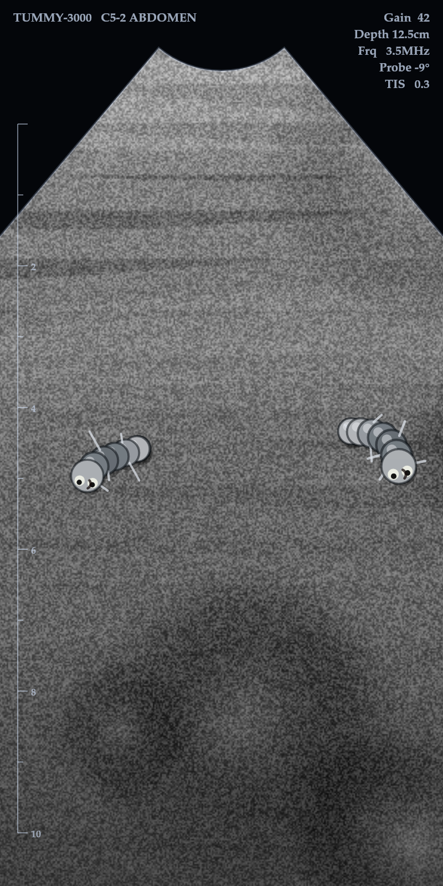

# 🪱 Tummy Scanner 3000

A pretend ultrasound for your phone. Point the camera at your kid's belly, scan,
and watch a wriggler show up on screen — because of what they ate today.

**▶ [Try it: gagikh.github.io/belly-scanner](https://gagikh.github.io/belly-scanner/index.html)**

> Open it on an **Android phone in Chrome**. It needs camera permission, and the
> flashlight button only works where the browser exposes torch control (Android does,
> iOS Safari doesn't).



*An actual frame from the app — the tissue here is a stand-in image, since the render
was captured without a camera attached.*

---

## The idea

Telling a five-year-old that sugar is bad does nothing. Showing them a worm in their
own belly, live, on a scanner that responds to what they ate — that lands.

The lesson is in the cause and effect, not in the scare. So:

1. **A grown-up ticks off what the child ate today** — before the scan, out of sight
   of the punchline.
2. **The scan runs** with a moving beam and a hiss, for as long as you like.
3. **You tap "SEE INSIDE"** when the suspense peaks.
4. **0, 1 or 2 wrigglers appear.** Never more — a swarm is frightening rather than
   instructive, and the point is that this is fixable.
5. **The verdict names the actual food**: *"Today you had cola and chips. That's exactly
   what the wrigglers like to eat. Swap one sugary thing for water tomorrow and scan again."*

All healthy? The tummy comes back clear, and the app says why.

---

## What's in it

**Ultrasound, not sci-fi.** The camera feed is desaturated and contrast-pushed, masked
into a curved-probe fan, grained with speckle, and framed with a depth ruler and machine
readouts. Worms render in the same greyscale and sit *under* the speckle pass, so they
read as being in the tissue rather than stickers on the glass.

**Motion sensors.** Tilting the phone pans the image; the worms slide with it at 82% of
that, which gives them depth. The tilt shows live in the readout as `Probe -9°`. Shake it
and the image blurs, the readout flips to `** MOVING **`, and it tells you to hold steadier.

**Hold and keep.** ❄️ freezes the frame (parallax and all) so you can take the phone off
the belly and show it around. 📸 saves a scan, and every reveal auto-saves — the last 8 live
in the gallery, so the second kid can see the same scan later.

**Runs on cheap phones.** Watches its own frame rate and sheds resolution and blur once if
it can't hold 26fps.

**One file, no dependencies.** No frameworks, no CDN, no build step for the web version.
Nothing leaves the device — saved scans sit in the browser's local storage.

---

## Build an Android APK

```powershell
.\build-apk.ps1 -Install
```

Wraps the HTML in a Capacitor shell, patches the manifest, builds, and pushes it to a
plugged-in phone. First run takes a few minutes; later ones about 20 seconds.

Prerequisites and the faster edit-test loop are in **[BUILD.md](BUILD.md)**.

---

## Files

| | |
|---|---|
| `index.html` | The entire app. |
| `build-apk.ps1` | Scaffolds a Capacitor project and builds an APK. |
| `BUILD.md` | Setup, switches, and Play Store notes. |
| `preview.png` | The screenshot above. |

`android-build/` is generated and gitignored.

---

## Not a medical device

This is a game. It does not detect anything, look inside anyone, or emit ultrasound —
it's the phone camera with a filter over it. Don't let a child believe otherwise, and
don't use it to talk about actual illness.

The nutrition messages are deliberately gentle: no food is called bad, nothing is
forbidden, and every result ends with something the child can do tomorrow. Kids form
lasting attitudes to food early, and fear isn't the tool you want.
